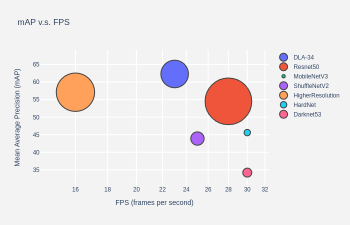
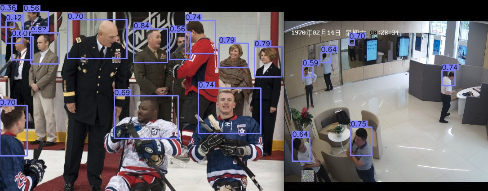
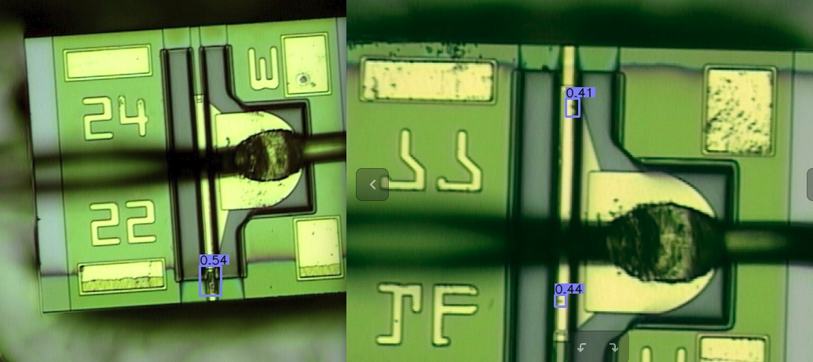
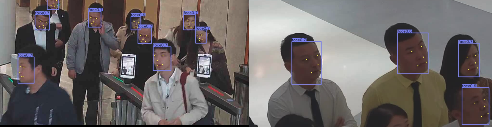

# CenterMulti代码实现参考以下
Object detection, 3D detection, and pose estimation using center point detection:

> [**Objects as Points**](http://arxiv.org/abs/1904.07850),            
> Xingyi Zhou, Dequan Wang, Philipp Kr&auml;henb&uuml;hl,        
> [**CenterNet code**](https://github.com/xingyizhou/centernet)         


## 1. Backebone

- **Strong**: 增加支持mobilenetV2,mobilenetV3,efficientdet，shufflenetv2，部分网络需要支持DCNv2.



## 2. Purpose

### 2.1 Object Detection

- **类别**: 可支持行人、人脸、车辆、缺陷等检测，只需要修改数据加载即可


| Backbone     |  AP / FPS | Flip AP / FPS|  Multi-scale AP / FPS |
|--------------|-----------|--------------|-----------------------|
|Hourglass-104 | 40.3 / 14 | 42.2 / 7.8   | 45.1 / 1.4            |
|DLA-34        | 37.4 / 52 | 39.2 / 28    | 41.7 / 4              |
|ResNet-101    | 34.6 / 45 | 36.2 / 25    | 39.3 / 4              |
|ResNet-18     | 28.1 / 142| 30.0 / 71    | 33.2 / 12             |

All models and details are available in > [**CenterNet MODEL_ZOO**](https://github.com/xingyizhou/CenterNet/blob/master/readme/MODEL_ZOO.md)  




### 2.2 keypoint or pose

- **姿态估计or关键点检测**: 修改keypoint的数量及coco加载keypoint的格式可针对性训练多种形式的pose(如landmark等)

      
> [**姿态估计参考centerpose**](https://github.com/tensorboy/centerpose) 

| Backbone     |  AP       |  FPS         | TensorRT Speed | Download |
|--------------|-----------|--------------|----------|----------|
|DLA-34        | 62.7      |    23      |  - |[model](https://drive.google.com/open?id=1IahJ3vpjTVu1p-Okf6lcn-bM7fVKNg6N)  |
|Resnet-50     | 54.5     |    28      |  33 |[model](https://drive.google.com/open?id=1oBgWrfigo2fGtpQJXQ0stADTgVFxPWGq)  |
|MobilenetV3   | 46.0      |    30      |  50 |[model](https://drive.google.com/open?id=1snJnADAD1NUzyO1QXCftuZu1rsr8095G)  |
|ShuffleNetV2  | 43.9      |    25      |  - |[model](https://drive.google.com/open?id=1FK7YQzCB6mLcb0v4SOmlqtRJfA-PQSvN)  |
|[High Resolution](https://github.com/HRNet/Higher-HRNet-Human-Pose-Estimation)| 57.1    |    16      |  - |[model](https://drive.google.com/open?id=1X0yxGeeNsD4VwU2caDo-BaH_MoCAnU_J)  |
|[HardNet]()| 45.6    |    30        | -  |[model](https://drive.google.com/open?id=1Y75bGuJyf1_Tr0ksoJ5Z7xaCp4v5DG2g)  |
|[Darknet53]()| 34.2    |    30        | -  |[model](https://drive.google.com/open?id=1S8spP_QKHqIYmWpfF9Bb4-4OoUXIOnkh)  |



### 2.3 model

> [**centerface/shoulder/defect模型**](https://pan.baidu.com/s/1DzlvIZ3ujEzNLsU50UWLNw) 提取码: u3pq

- **defect**: defect模型基于mobilenetv2训练，由于部分数据标定不准，所以结果会有偏差，建议只供pre-train.

- **centerface**: 该版本的centerface是基于修改的centernet训练，训练数据参照widerface，其中对质量不好的face做了过滤，使其更适合人脸识别的工程应用，模型有两个，分别是3.5M和8.9M.

```
centerface的训练：例如修改lib/datasets/coco_hp.py里num_joints = 5;flip_idx = [[0, 1], [3, 4]]以及整个项目里17的关节点数全部置换成5，dets[39:51]这类全部换成dets[15:20]等
```

## 3. TensorRT
1. torch转onnx

```
python convert2onnx.py
```

2. onnx转TensorRT

```
python demo_tensorrt.py
```

3. 检测框架支持的TensorRT

> [**TensorRT C++**](https://github.com/CaoWGG/TensorRT-CenterNet) 


```
    #shoulder检测模型支持该框架加速（不需要DCNs），total runtime = 3.82147 ms
    #在include/ctdetConfig.h里添加以下，然后cmake即可
    constexpr static int input_w = 512 ;
    constexpr static int input_h = 512 ;
    constexpr static int channel = 3 ;
    constexpr static int classNum = 1 ;
    constexpr static float mean[]= {0.408, 0.447, 0.470};
    constexpr static float std[] = {0.289, 0.274, 0.278};
    constexpr static char *className[]= {(char*)"shoulder"};
```

## Citation

If you find this project useful for your research, please use the following BibTeX entry.

    @contact{yangsai1991@163.com,
      title={Objects as Points},
      author={bleakie},
      year={2019}
    }
